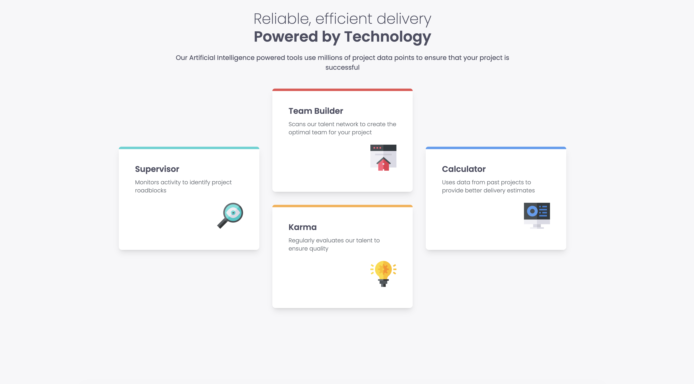
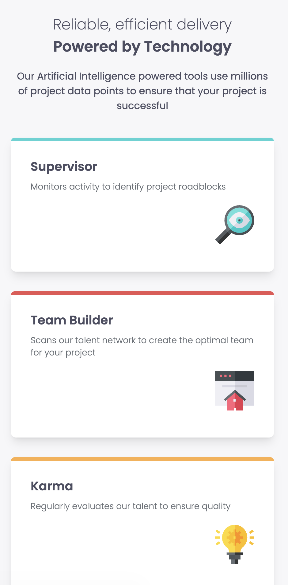

# Frontend Mentor - Four Card Feature Section

This is my solution to the [Four Card Feature Section challenge on Frontend Mentor](https://www.frontendmentor.io/challenges/four-card-feature-section-weK1eFYK).  
It was built using **React** and **Tailwind CSS**. The goal was to create a responsive layout showcasing four feature cards in an attractive and accessible design.

---

## 🔗 Live Site

👉 [Live preview here](https://umutyavyz.github.io/Frontend-Mentor-Four-Card-Feature-Section/)

---

## 📸 Screenshots

### Desktop Design

### Mobile Design

---

## 🛠️ Technologies Used

- HTML5
- Tailwind CSS
- Git & GitHub
- [Frontend Mentor](https://www.frontendmentor.io/)

---

## 💡 What I Learned

- Creating responsive multi-column layouts with CSS Grid and Flexbox
- Building card-based components with consistent spacing and typography
- Implementing responsive design patterns for different screen sizes
- Working with color schemes and maintaining visual hierarchy
- Structuring semantic HTML for accessibility

---

## 🧩 Useful Resources

- [CSS Grid Layout Guide](https://css-tricks.com/snippets/css/complete-guide-grid/)
- [Tailwind CSS Grid Documentation](https://tailwindcss.com/docs/grid-template-columns)
- [Frontend Mentor Challenges](https://www.frontendmentor.io/challenges)
- [MDN Responsive Design](https://developer.mozilla.org/en-US/docs/Learn/CSS/CSS_layout/Responsive_Design)

---

## ✍️ Author

- GitHub: [@umutyavyz](https://github.com/umutyavyz)  
- Frontend Mentor: [@umutyavyz](https://www.frontendmentor.io/profile/umutyavyz)  

---

## 📜 License

This project is open source and available under the [MIT License](LICENSE).
